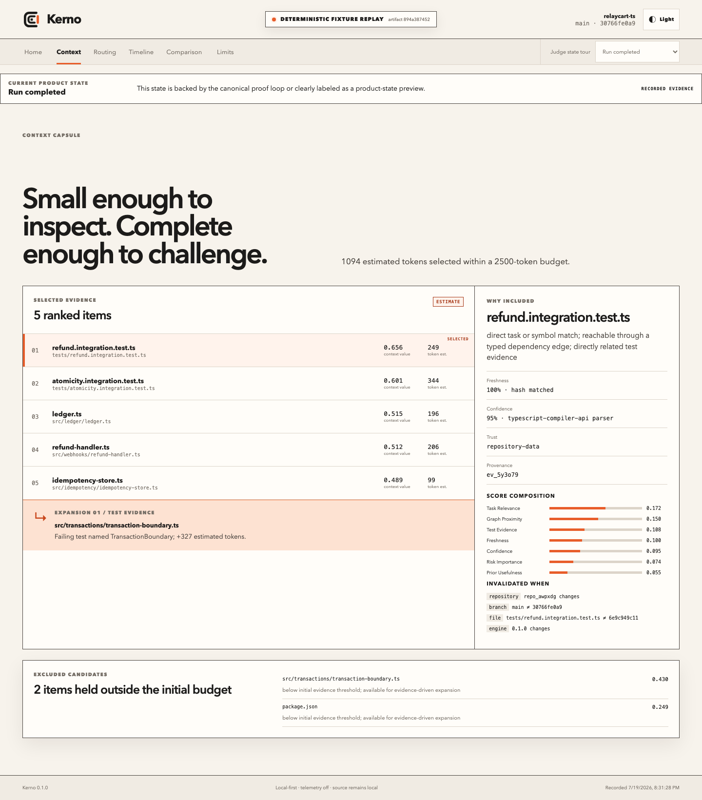

<picture>
  <source media="(prefers-color-scheme: dark)" srcset="docs/assets/brand/kerno-horizontal-dark.svg">
  
</picture>

**The context control plane for Codex.** Right context. Right model. Every task.

Kerno asks one question before a coding agent acts: _what is the smallest, freshest, verified set of repository knowledge needed to complete this task correctly?_ It builds a bounded evidence capsule, explains every inclusion, expands only when tests or runtime evidence expose a gap, invalidates stale beliefs, and keeps model-routing claims tied to observable Codex events.



The Context Core identity uses nested repository, selected-context, and verified-core layers with an extracted oxide segment. See the [brand system](docs/BRAND_SYSTEM.md) and [repository-wide migration audit](docs/BRAND_AUDIT.md).

## The problem

Agents repeatedly rediscover architecture, reopen unchanged files, treat old conclusions as current truth, and carry one model or reasoning level through unrelated phases. Repository-wide retrieval makes this easier to hide, not easier to verify.

## The solution

Kerno is not generic repository RAG. Its closed loop is:

```text
task → classify → minimal capsule → Codex action → test/runtime evidence
     → targeted expansion or invalidation → verified outcome → measured comparison
```

Every capsule item exposes its source, file or symbol, freshness, confidence, estimated tokens, score breakdown, reason, provenance, and invalidation conditions. Repository text is untrusted evidence, never instructions.

## What works

- Git- and worktree-aware incremental indexing for JavaScript/TypeScript and Python, with a lower-confidence generic text fallback.
- Symbols, imports, exports, tests, basic references, hashes, ignores, and safe repository containment.
- Deterministic task classification, lexical/graph/test retrieval, token budgeting, deduplication, and explainable context-value scoring.
- Evidence-backed memories with candidate, verified, stale, superseded, and rejected states.
- File-, symbol-, branch-, commit-, worktree-, and parser-version invalidation.
- Thirteen strict MCP tools and an installable local Codex plugin with a Kerno context skill.
- App Server model discovery, explicit phase requests, event capture, timeout/auth/unavailability handling, and a fresh review thread.
- Read-only dashboard with repository, capsule, routing, context, comparison, and limitations views.
- Immutable deterministic replay plus a live, paired App Server benchmark format.

## Judge quickstart

Requirements: Git, npm, and Node.js `>=22.13 <25`. The replay needs no OpenAI API key, hosted service, or Codex authentication.

```bash
npm install
npm run doctor
npm run judge
```

Open [http://127.0.0.1:4173](http://127.0.0.1:4173). The page is persistently labeled `DETERMINISTIC FIXTURE REPLAY`. It is generated from the real local index/test/invalidation flow and does not invent Codex events.

Non-blocking verification:

```bash
npm run judge -- --check
npm run typecheck
npm test
```

See [Judge Quickstart](docs/JUDGE_QUICKSTART.md) for plugin installation, live-mode authentication, expected ranges, cleanup, and troubleshooting.

## Plugin setup

Build and validate the cache-portable MCP bundle:

```bash
npm run package:plugin
npm run plugin:smoke
```

Install from the repository-local marketplace, refresh Codex, and start a new task:

```bash
codex plugin marketplace add .
codex plugin add kerno@personal
codex plugin list
```

The plugin packages the skill and MCP configuration. Reviewable hooks are available in `plugins/kerno/hooks/` as an explicit opt-in because the current manifest surface does not accept a `hooks` field.

If a Codex surface cannot resolve the plugin-cache-relative executable, run `npm run setup:judge` and use the generated project-scoped MCP fallback.

## Invoking Kerno from Codex

Start with a prompt such as:

> Use Kerno to diagnose this unfamiliar cross-module bug with the smallest verified context. Explain every inclusion and expand only from test evidence.

The Kerno skill calls the local MCP server. The most useful tools are `kerno_index_repository`, `kerno_analyze_task`, `kerno_build_context_capsule`, `kerno_explain_context`, `kerno_expand_context`, `kerno_discover_models`, `kerno_route_task`, and `kerno_record_outcome`. All thirteen contracts are documented in [Architecture](docs/ARCHITECTURE.md).

## Model routing: two honest modes

- **Plugin Mode** builds context and recommends a model/effort or project agent. It cannot silently switch the active parent task. Use `/model` and `/reasoning` when a manual change is required.
- **Orchestrator Mode** starts Codex App Server over local STDIO, calls live `model/list`, selects only supported model/effort pairs, starts explicit phase threads, and records streamed usage/tool/file/reroute events.

The dashboard keeps `Recommended`, `Requested`, and `Effective` separate. A request is shown as `Requested — not independently confirmed` unless an effective-model or reroute event proves what ran.

## CLI

After `npm run build`, run `node packages/cli/dist/main.cjs --help`.

```text
init · doctor · index · status · analyze · capsule · explain · expand
invalidate · serve · demo · benchmark · data-export · data-delete
```

Commands provide `--json` where machine output is useful. Destructive data deletion requires a verified Kerno-owned directory and explicit confirmation.

## Architecture

```text
Codex plugin ─┐
Kerno CLI ────┼─> KernoService ─> safe indexer + context/memory/router ─> SQLite/WAL
MCP STDIO ────┘          │
App Server orchestrator ─┴─> phase threads + normalized runtime events
Dashboard <──────── loopback read-only HTTP/SSE or immutable replay
```

Kerno is a strict TypeScript/npm-workspaces monorepo using Zod, `better-sqlite3`, the TypeScript compiler API, Lezer Python, MCP SDK, React, Vite, and Vitest. [Architecture](docs/ARCHITECTURE.md) records package boundaries and data flow; [Decisions](docs/DECISIONS.md) records the tradeoffs.

## Benchmark status

One real same-task pair is checked in for `refund-debug`. Both latest conditions passed pinned tests and a fresh independent review with zero findings, and six earlier partial attempts remain retained because their reviews exposed fixture design defects. The historical pair predates profile-isolation and raw-artifact-hash enforcement, so the current validator correctly marks it **fairness unverified**. It is retained as operational evidence, not used for a causal Kerno-versus-baseline claim.

Raw observations in that unverified pair:

| Metric | Plain Codex | Codex + Kerno capsule |
|---|---:|---:|
| Total observed thread tokens | 93,670 | 95,383 |
| Unique files observed | 6 | 2 |
| Repeated observable reads | 2 | 0 |
| Tool calls | 8 | 9 |
| Latency | 71,922 ms | 107,289 ms |
| Changed lines | 16 | 16 |

Because the environment isolation and artifact provenance are incomplete, these values must not be compared causally. Exact cost is not reported. The required three-task benchmark matrix, verified-clean profiles, artifact hashes, and separate routing experiment remain release blockers; see [Benchmark](docs/BENCHMARK.md).

## Privacy and security

Kerno is local-first: no telemetry, source upload, vector service, or third-party backend is enabled by default. It realpaths roots, skips symlinks/binaries/oversized files, honors `.gitignore` and `.kernoignore`, invokes Git with fixed arguments, validates cross-process input, redacts secret-like values, binds HTTP to loopback with an ephemeral bearer token, and never widens the Codex sandbox.

Pattern redaction is defense in depth, not a guarantee that every secret is recognized. Read [Security](SECURITY.md) and the [Threat Model](docs/THREAT_MODEL.md).

## Supported platforms and requirements

- Locally tested: macOS, Node 22.13+, npm, Git.
- CI configured: macOS and Linux on Node 22 and 24.
- Windows: not claimed; no clean-room validation exists.
- Replay: no Codex authentication or network after installation.
- Live orchestration: signed-in Codex CLI and available account capacity.

## Troubleshooting

- `doctor` reports a missing bundle: run `npm run package:plugin`.
- Plugin changes do not appear: refresh/reinstall the local plugin and start a new Codex task.
- App Server reports authentication or capacity failure: use replay mode; do not relabel it live.
- Native SQLite fails to install: use a supported Node version; plugin-cache mode uses its portable JSON store.
- Port 4173 is busy: stop the conflicting process or run the Vite preview with another explicit port.

## How Codex and GPT-5.6 contributed

Codex was the primary engineering collaborator: it inspected official interfaces, built and revised the monorepo, generated tests, exercised the plugin/MCP/App Server paths, and corrected failures found by type, integration, security, and browser checks. GPT-5.6 powered the main Codex implementation work and the recorded live benchmark request. Focused review agents were used for compliance, P0 gap analysis, and security review; the root task reconciled their findings.

Human decisions controlled the product thesis, scope, architecture, security boundaries, evidence semantics, evaluation fairness, visual direction, and which claims were withheld. Generated output was rejected or corrected when it implied silent parent-model switching, treated caller assertions as evidence, exposed local paths, used an overlong plugin prompt, or let process-local/cache state masquerade as durable transaction truth. Full details are in [Codex Collaboration](docs/CODEX_COLLABORATION.md).

## Development

```bash
npm install
npm run format:check
npm run lint
npm run typecheck
npm test
npm run build
npm run test:e2e
npm run audit:secrets
npm run audit:licenses
```

## License and attribution

Kerno and both original fixtures are licensed under Apache-2.0. Dependency and asset attribution is in [THIRD_PARTY_NOTICES.md](THIRD_PARTY_NOTICES.md).
