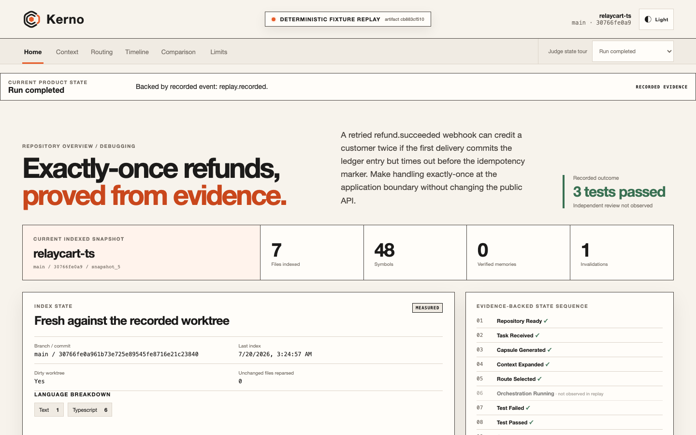
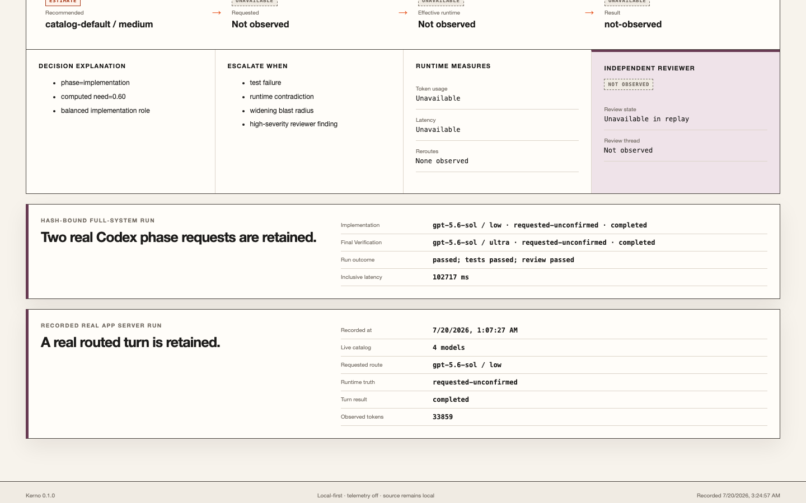
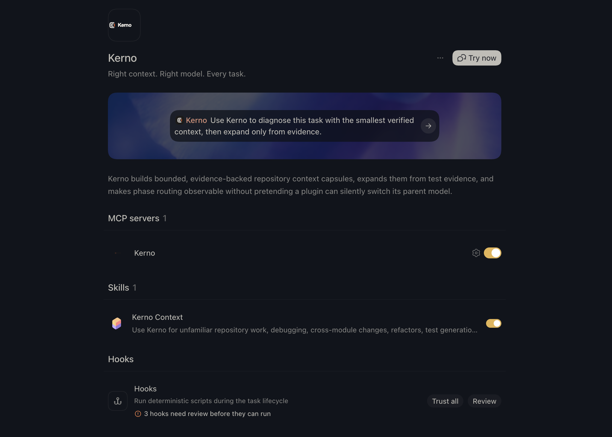

<picture>
  <source media="(prefers-color-scheme: dark)" srcset="docs/assets/brand/kerno-horizontal-dark.svg">
  
</picture>

**The context control plane for Codex.** Right context. Right model. Every task.

Kerno asks one question before a coding agent acts: _what is the smallest, freshest, verified set of repository knowledge needed to complete this task correctly?_ It builds a bounded evidence capsule, explains every inclusion, expands only when tests or runtime evidence expose a gap, invalidates stale beliefs, and keeps model-routing claims tied to observable Codex events.



_Deterministic fixture replay:_ the Home view is generated from the local index → failing test → child capsule → passing test → invalidation evidence loop. It does not depict a live Codex implementation turn.



_Separate real App Server evidence:_ the routing evidence panel retains an authenticated App Server request and its runtime truth label. It is not merged with, or presented as part of, the deterministic replay.



_Real Codex plugin surface:_ the installed plugin exposes one Kerno MCP server, one Kerno Context skill, and three review-gated hooks. The blue-violet prompt backdrop belongs to the Codex host interface; Kerno's own dashboard and assets use the warm oxide, graphite, ivory, stone, and aubergine system.

The Context Core identity uses nested repository, selected-context, and verified-core layers with an extracted oxide segment. See the [brand system](docs/BRAND_SYSTEM.md) and [repository-wide migration audit](docs/BRAND_AUDIT.md).

## The problem

Agents repeatedly rediscover architecture, reopen unchanged files, treat old conclusions as current truth, and carry one model or reasoning level through unrelated phases. Repository-wide retrieval makes this easier to hide, not easier to verify.

## The solution

Kerno is not generic repository RAG. Its closed loop is:

```text
task → classify → minimal capsule → Codex action → test/runtime evidence
     → targeted expansion or invalidation → verified outcome → measured comparison
```

Every capsule item exposes its source, file or symbol, freshness, confidence, estimated tokens, score breakdown, reason, provenance, and invalidation conditions. Repository text is untrusted evidence, never instructions.

## What works

- Git- and worktree-aware incremental indexing for JavaScript/TypeScript and Python, with a lower-confidence generic text fallback.
- Symbols, imports, exports, tests, basic references, hashes, ignores, and safe repository containment.
- Deterministic task classification, lexical/graph/test retrieval, token budgeting, deduplication, and explainable context-value scoring.
- Evidence-backed memories with candidate, verified, stale, superseded, and rejected states.
- File-, symbol-, branch-, commit-, worktree-, and parser-version invalidation.
- Sixteen strict MCP tools and an installable local Codex plugin with a Kerno context skill and structured evidence tracker state.
- Browser-tested MCP Apps component source for onboarding, repository overview, context inspection, route truth, timelines, and local settings; developer-app registration is still required before Codex can render it inline.
- App Server model discovery, explicit phase requests, event capture, timeout/auth/unavailability handling, and a fresh review thread.
- Read-only dashboard with repository, capsule, routing, context, comparison, and limitations views.
- Reproducibly generated deterministic replay plus a live, paired App Server benchmark format.

## Judge quickstart

Requirements: Git, npm, and Node.js `>=22.13 <25`. The replay needs no OpenAI API key, hosted service, or Codex authentication.

Open the no-install judge replay: **[itkerno.site](https://itkerno.site)**. It is a read-only deployment reproducibly generated from the checked-in fixture and separately labeled retained App Server evidence. It never receives repository source and is not presented as a live Codex run. The local commands below remain the authoritative path for reproducing the current comparison matrix.

```bash
npm install
npm run doctor
npm run judge
```

Open [http://127.0.0.1:4173](http://127.0.0.1:4173). The page is persistently labeled `DETERMINISTIC FIXTURE REPLAY`. It is generated from the real local index/test/invalidation flow and does not invent Codex events.

Non-blocking verification:

```bash
npm run judge -- --check
npm run typecheck
npm test
```

See [Judge Quickstart](docs/JUDGE_QUICKSTART.md) for plugin installation, live-mode authentication, expected ranges, cleanup, and troubleshooting.

## Where Kerno's UI lives

Kerno has three truthful surfaces:

- **Inside Codex today:** the installed plugin contributes the Kerno card, starter prompts, Context skill, and 16 MCP tools. `kerno_render_panel` returns validated onboarding, repository, capsule, routing, timeline, and settings state as structured output. The component source exists and passes its browser host harness, but the plugin does not yet declare a registered app ID, so inline/fullscreen rendering is not claimed.
- **Web dashboard:** the React/Vite interface visualizes checked-in repository, capsule, routing, test, invalidation, and comparison evidence. The current P0 build is replay-oriented; the loopback daemon exposes read-only snapshot/SSE endpoints, but the dashboard is not continuously connected to them. The public Vercel deployment is replay-only.
- **CLI:** `kerno doctor`, `index`, `capsule`, `explain`, `serve`, `benchmark`, export, and cleanup commands support direct local operation.

The separation is intentional: repository intelligence and live orchestration stay local, while the hosted judge link provides a zero-install, source-free product tour.

## Plugin setup

Build and validate the cache-portable MCP bundle:

```bash
npm run package:plugin
npm run plugin:smoke
```

Install from the repository-local marketplace, refresh Codex, and start a new task:

```bash
codex plugin marketplace add .
codex plugin add kerno@personal
codex plugin list
```

The plugin packages the skill and MCP configuration. Reviewable hooks are available in `plugins/kerno/hooks/` as an explicit opt-in because the current manifest surface does not accept a `hooks` field.

The working visual judge surface is Kerno’s web dashboard. It is driven by validated local service/replay data and labels recommendation, request, effective-model evidence, estimates, and unavailable values separately. The MCP Apps component uses the same contracts, but genuine Codex rendering requires a developer-mode app registration, streaming HTTPS MCP endpoint, and manifest wiring that are not present in this release.

The installed plugin's run store is process-scoped to prevent concurrent Codex hosts from corrupting one JSON document. A separate owner-controlled atomic settings store preserves onboarding and experience preferences across fresh tasks. Durable cross-task engineering memory uses the daemon's SQLite store. The public MCP contract intentionally does **not** accept a caller assertion that a test passed or failed as trusted evidence; verified expansion in Plugin Mode still requires a trusted artifact. The deterministic replay's expansion step is generated by the trusted in-process evaluation harness and is labeled accordingly.

If a Codex surface cannot resolve the plugin-cache-relative executable, run `npm run setup:judge` and use the generated project-scoped MCP fallback.

## Invoking Kerno from Codex

Start with a prompt such as:

> Use Kerno to diagnose this unfamiliar cross-module bug with the smallest verified context. Explain every inclusion and expand only from test evidence.

The Kerno skill calls the local MCP server. Mention Kerno without a task to request first-run onboarding state. For repository work, the skill builds the capsule and then calls `kerno_render_panel` so Codex receives the structured inspector state. The most useful data tools are `kerno_index_repository`, `kerno_analyze_task`, `kerno_build_context_capsule`, `kerno_explain_context`, `kerno_expand_context`, `kerno_discover_models`, `kerno_route_task`, and `kerno_record_outcome`. `kerno_get_settings`, `kerno_update_settings`, and `kerno_render_panel` own the local experience state. Expansion and verified outcomes require a trusted artifact already present in Kerno state; callers cannot promote arbitrary prose or exit codes into evidence. All sixteen contracts are documented in [Architecture](docs/ARCHITECTURE.md).

## Model routing: two honest modes

- **Plugin Mode** builds context and recommends a model/effort or project agent. It cannot silently switch the active parent task. Use `/model` and `/reasoning` when a manual change is required.
- **Orchestrator Mode** starts Codex App Server over local STDIO, calls live `model/list`, selects only supported model/effort pairs, starts explicit phase threads, and records streamed usage/tool/file/reroute events.

The dashboard keeps `Recommended`, `Requested`, and `Effective` separate. A request is shown as `Requested — not independently confirmed` unless an effective-model or reroute event proves what ran.

## CLI

After `npm run build`, run `node packages/cli/dist/main.cjs --help`.

```text
init · doctor · index · status · analyze · capsule · explain · expand
invalidate · serve · demo · benchmark · data-export · data-delete
```

Commands provide `--json` where machine output is useful. Destructive data deletion requires a verified Kerno-owned directory and explicit confirmation.

## Architecture

```text
Codex plugin ─┐
Kerno CLI ────┼─> KernoService ─> safe indexer + context/memory/router ─> SQLite/WAL
MCP STDIO ────┘          │
App Server orchestrator ─┴─> phase threads + normalized runtime events
Dashboard <──────── loopback read-only HTTP/SSE or generated read-only replay
```

Kerno is a strict TypeScript/npm-workspaces monorepo using Zod, `better-sqlite3`, the TypeScript compiler API, Lezer Python, MCP SDK, React, Vite, and Vitest. [Architecture](docs/ARCHITECTURE.md) records package boundaries and data flow; [Decisions](docs/DECISIONS.md) records the tradeoffs.

## Benchmark status

Kerno retains three fairness-valid context-controlled pairs and one separate full-system routing pair. Each current condition uses an auth-only temporary Codex profile, immutable pair ID, matching task/commit/permissions/model/effort where required, hash-bound raw artifacts, pinned tests, and a fresh reviewer.

Correctness comes first: both conditions passed on `refund-debug` and `refund-transaction-change`; both conditions failed the Python `queue-retry-refactor` task and each received one reviewer finding. That unfavorable result remains in the report. Across the two correctness-passing context pairs, Kerno used fewer observed tokens, fewer completed tools, and fewer changed lines in these single-run case studies. The separate routing pair also passed in both conditions, but Kerno's requested phase models remain `requested-unconfirmed` because the runtime emitted no effective-model or reroute event.

These are real recorded observations, not generalized productivity claims. Files opened and repeated reads remain unavailable in the strengthened runs because the emitted events do not provide a defensible read signal. Exact cost is not reported. See [Benchmark](docs/BENCHMARK.md) for every number, retained failure, hash-bound artifact, reproduction command, and statistical limitation.

## Privacy and security

Kerno is local-first: no telemetry, source upload, vector service, or third-party backend is enabled by default. It realpaths roots, skips symlinks/binaries/oversized files, honors `.gitignore` and `.kernoignore`, invokes Git with fixed arguments, validates cross-process input, redacts secret-like values, binds HTTP to loopback with an ephemeral bearer token, and never widens the Codex sandbox.

Pattern redaction is defense in depth, not a guarantee that every secret is recognized. Read [Security](SECURITY.md) and the [Threat Model](docs/THREAT_MODEL.md).

## Supported platforms and requirements

- Locally tested: macOS, Node 22.13+, npm, Git.
- CI configured: macOS and Linux on Node 22 and 24.
- Windows: not claimed; no clean-room validation exists.
- Replay: no Codex authentication or network after installation.
- Live orchestration: signed-in Codex CLI and available account capacity.

## Troubleshooting

- `doctor` reports a missing bundle: run `npm run package:plugin`.
- Plugin changes do not appear: refresh/reinstall the local plugin and start a new Codex task.
- App Server reports authentication or capacity failure: use replay mode; do not relabel it live.
- Native SQLite fails to install: use a supported Node version; plugin-cache mode uses process-scoped portable run state plus a bounded-lifetime local settings store. Durable cross-task engineering memory uses the daemon's SQLite store.
- Port 4173 is busy: stop the conflicting process or run the Vite preview with another explicit port.

## How Codex and GPT-5.6 contributed

Codex was the primary engineering collaborator: it inspected official interfaces, built and revised the monorepo, generated tests, exercised the plugin/MCP/App Server paths, and corrected failures found by type, integration, security, and browser checks. The main implementation task used GPT-5.6. A retained App Server run also requested a live-discovered GPT-5.6 model, but the runtime did not emit an effective-model or reroute event, so Kerno labels that request `requested-unconfirmed`. Focused review agents were used for compliance, P0 gap analysis, and security review; the root task reconciled their findings.

Human decisions controlled the product thesis, scope, architecture, security boundaries, evidence semantics, evaluation fairness, visual direction, and which claims were withheld. Generated output was rejected or corrected when it implied silent parent-model switching, treated caller assertions as evidence, exposed local paths, used an overlong plugin prompt, or let process-local/cache state masquerade as durable transaction truth. Full details are in [Codex Collaboration](docs/CODEX_COLLABORATION.md).

## Development

```bash
npm install
npm run format:check
npm run lint
npm run typecheck
npm test
npm run build
npm run test:e2e
npm run audit:secrets
npm run audit:licenses
```

## License and attribution

Kerno and both original fixtures are licensed under Apache-2.0. Dependency and asset attribution is in [THIRD_PARTY_NOTICES.md](THIRD_PARTY_NOTICES.md).
